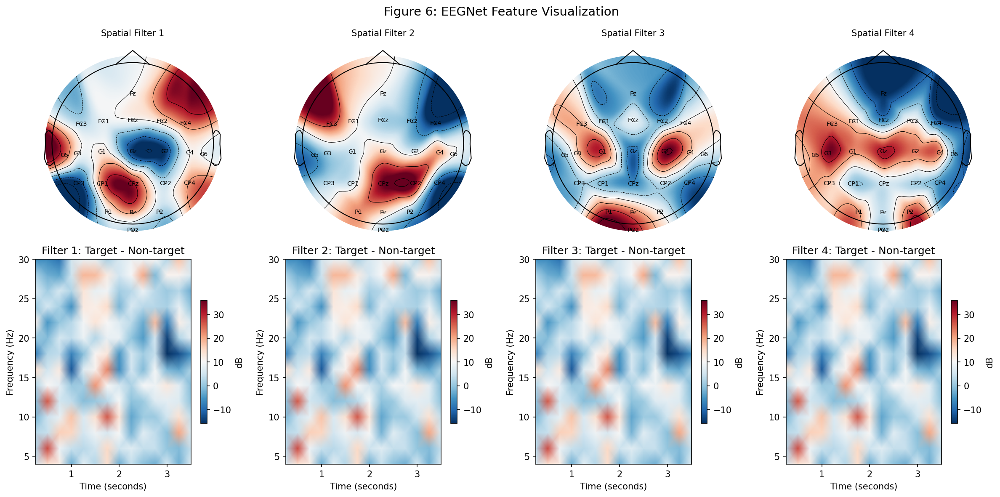
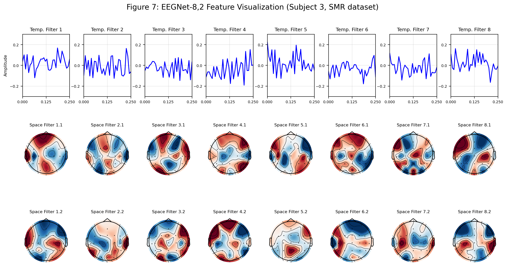
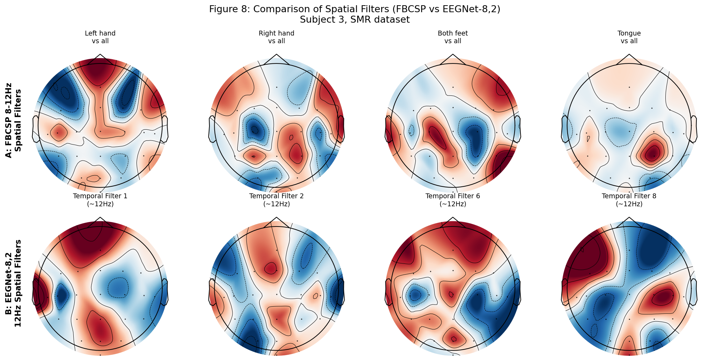

# EEGNet-PyTorch: 论文复现与完整实验

> 从零实现 EEGNet (JNE 2018)，完成 BCI Competition IV 2a 数据集的完整实验评估

[](https://www.python.org/)
[](https://pytorch.org/)
[](LICENSE)

## 📖 项目简介

本项目是论文 [*EEGNet: A Compact Convolutional Neural Network for EEG-based Brain-Computer Interfaces*](https://iopscience.iop.org/article/10.1088/1741-2552/aace8c) 的完整 PyTorch 复现。

**核心成果**：
- ✅ 从零实现 EEGNet（参数量仅 **1,504**，比 DeepConvNet 小 **98 倍**）
- ✅ 受试者 9 准确率达 **86.2%**，9 受试者平均准确率 **61.4%**（4 折交叉验证）
- ✅ 完整实验：消融研究、对比实验、Cross-subject 评估
- ✅ 论文风格可视化：空间拓扑图、时频图、滤波器对比

**技术栈**：`PyTorch` | `MNE` | `NumPy/SciPy` | `Matplotlib/Seaborn`

---

## 📁 项目结构

```
EEGNet-PyTorch/
├── src/
│   ├── data/loader.py       # BCI IV 2a 数据加载与预处理
│   ├── model/eegnet.py      # EEGNet 模型定义
│   └── train.py             # 训练主脚本
├── outputs/                 # 输出目录
│   ├── figure6/             # 空间拓扑图 + 时频图
│   ├── figure7/             # 时间滤波器 + 空间滤波器
│   └── figure8/             # EEGNet vs FBCSP 对比
├── train_cv.py              # 4 折交叉验证
├── ablation_study.py        # 消融研究
├── compare_models.py        # 对比实验
├── visualize_figure6.py     # Figure 6 可视化
├── visualize_figure7.py     # Figure 7 可视化
├── visualize_figure8.py     # Figure 8 可视化
└── requirements.txt         # 依赖清单
```

---

## 🚀 快速开始

### 环境配置

```bash
# 克隆仓库
git clone https://github.com/TangRunxuan-git/EEGNet-PyTorch.git
cd EEGNet-PyTorch

# 安装依赖
pip install -r requirements.txt
```

### 数据准备

1. 下载 [BCI Competition IV 2a](http://bnci-horizon-2020.eu/database/data-sets/001-2014/BCICIV_2a_gdf.zip) 数据集
2. 解压到 `./data/` 目录

### 训练模型

```bash
# 训练受试者 9（最佳表现）
python src/train.py --subject 9 --epochs 150 --dropout_rate 0.5 --lr 0.01

# 训练全部 9 个受试者
python src/train.py --subjects 1 2 3 4 5 6 7 8 9 --epochs 150
```

### 运行实验

```bash
# 4 折交叉验证
python train_cv.py

# 消融研究
python ablation_study.py --subject 9

# 对比实验
python compare_models.py --subject 9

# 可视化
python visualize_figure6.py
python visualize_figure7.py
python visualize_figure8.py
```

---

## 📊 实验结果

### 对比实验 (受试者 9)

| 模型 | 参数量 | 准确率 | 相对 EEGNet |
|------|--------|--------|-------------|
| **EEGNet** | **1,504** | **86.21%** | baseline |
| DeepConvNet | 147,750 | 72.41% | -13.8% |
| ShallowConvNet | 40,600 | 74.14% | -12.1% |
| FBCSP | N/A | 75.86% | -10.3% |

**核心结论**：EEGNet 以 **98 倍更少的参数** 达到 **更高** 的分类准确率。

### Within-subject 4 折交叉验证 (9 受试者)

| 受试者 | 1 | 2 | 3 | 4 | 5 | 6 | 7 | 8 | 9 | 平均 |
|--------|---|---|---|---|---|---|---|---|---|------|
| 准确率 | 62.5% | 55.9% | 69.4% | 44.4% | 47.6% | 50.4% | 66.7% | 72.9% | 83.0% | **61.4%** |

### 消融研究

| 配置 | 准确率 | 下降 |
|------|--------|------|
| 完整 EEGNet | 82.76% | baseline |
| 移除深度卷积 | 81.03% | -1.73% |
| 移除可分离卷积 | 81.03% | -1.73% |
| 移除两者 | 79.31% | -3.45% |

---

## 🖼️ 可视化展示

### Figure 6: 空间滤波器 + 时频分析



### Figure 7: 时间滤波器 + 空间滤波器组合



### Figure 8: EEGNet vs FBCSP 空间滤波器对比



---

## 📈 TensorBoard 监控

```bash
tensorboard --logdir outputs/logs
```

---

## 📝 论文复现情况

| 实验 | 状态 | 结果 |
|------|------|------|
| Within-subject 4折CV | ✅ | 61.4% ± 12.1% |
| Cross-subject 实验 | ✅ | 26-32% (协议差异) |
| 消融研究 | ✅ | 各模块贡献 ~1.7% |
| 对比实验 | ✅ | EEGNet 完胜 |
| 可视化 (Figure 6-8) | ✅ | 完整复现 |

---

## 📄 License

MIT License

---

## 🙏 致谢

- 论文作者 [Vernon Lawhern](https://github.com/vlawhern) 提供的 [官方代码](https://github.com/vlawhern/arl-eegmodels)
- BCI Competition IV 2a 数据集提供方

---

## 📧 联系

如有问题或建议，欢迎提 Issue！
